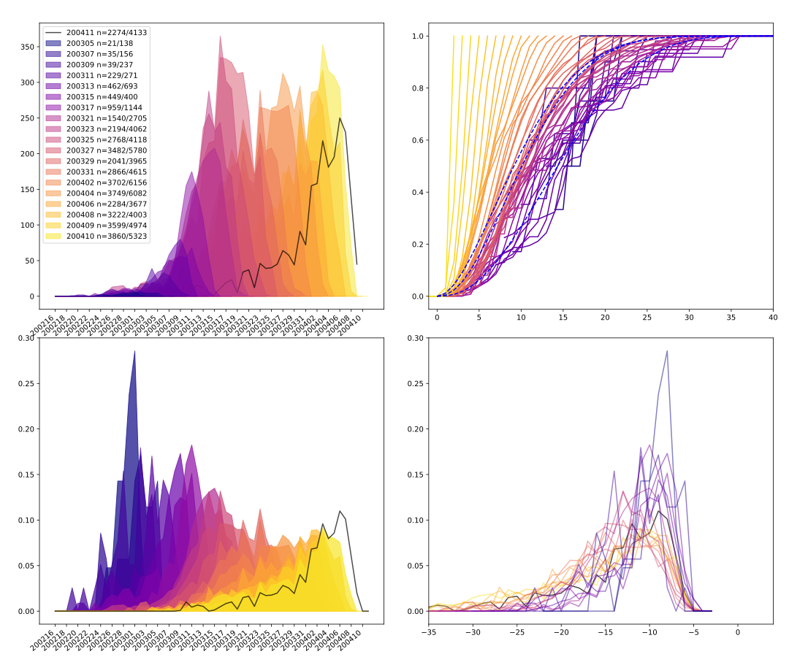

# COVID19 cases in Germany by date of onset of illness from RKI daily situational reports

An up to date version of the Website is available at http://mlinden.de/COVID19/index.html

## onset of illness data
For proper simulation of the outbreak with a SIR or SIRE model, date of onset of illness is crucial if modeling of the reporting process is omitted. Unfortunately the publicly available databases behind RKI's  or JHU's dashboard don't supply this information. The RKI publishes daily situation reports (<a href="https://www.rki.de/DE/Content/InfAZ/N/Neuartiges_Coronavirus/Situationsberichte/Gesamt.html">RKI daily report</a>) which contain a graph of cases by date of onset of illness. These graphs are digitized, the data is postprocessed (light cleanup und formating) and output as a .json file to be used in a dynamic plot on my website.

### projection and missing data (work in progress)
The RKI's graph conaints both counts for cases with known date of onset as well as counts for case-reports without that data or asymptomatic cases. These cases could be allocated to a date of onset based on yet to be determined assumptions...

### reporting delay
A quick glance indicates that 5 days after date of onset of illness 10% of cases are reported, 50% after 10 days, 90% after 20 days and >95% after 30 days. The shape of the distribution of time_since_onset for casees in a report varies with time.

	

## goal
Supply an independant estimate for the parameter R based on publicly available data in order to educate (myself at the moment) about processes involved between infection and reporting.

